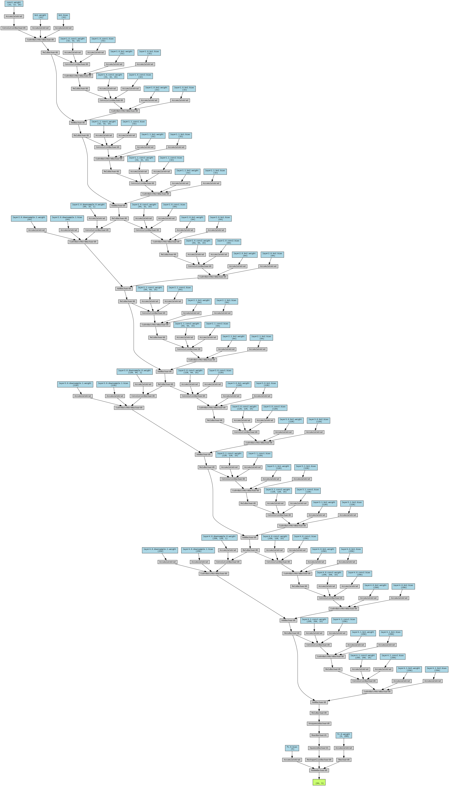
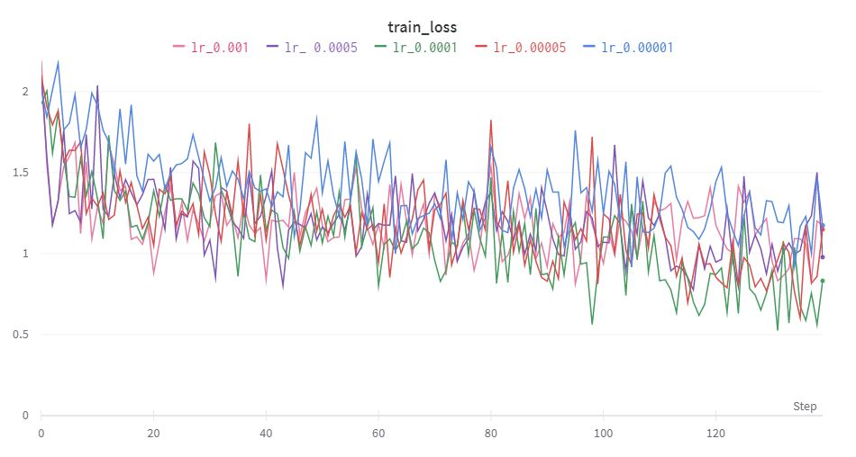
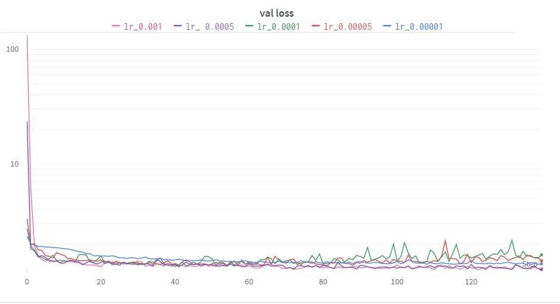
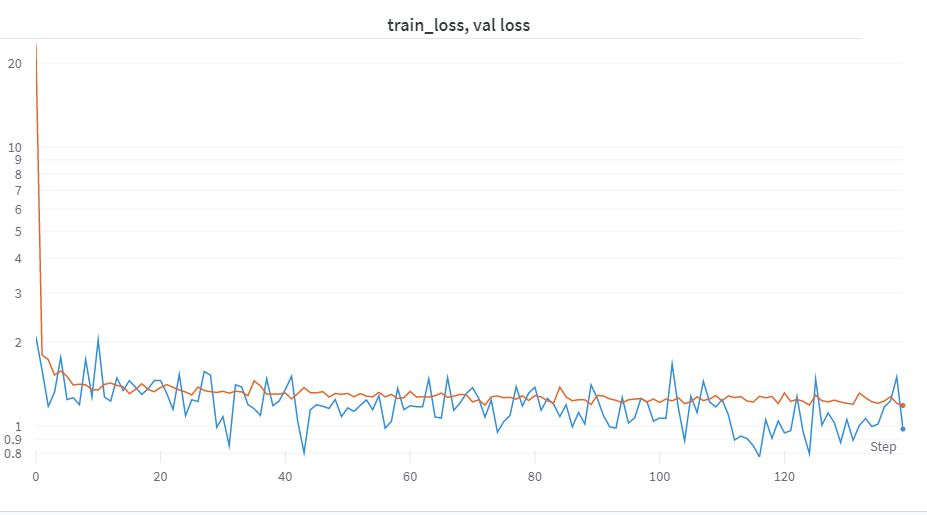
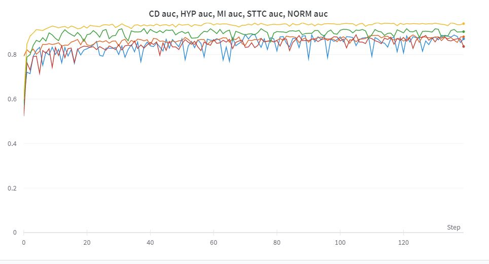
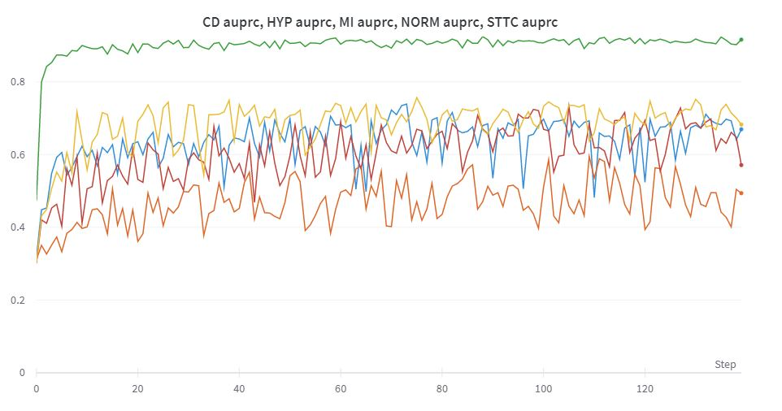
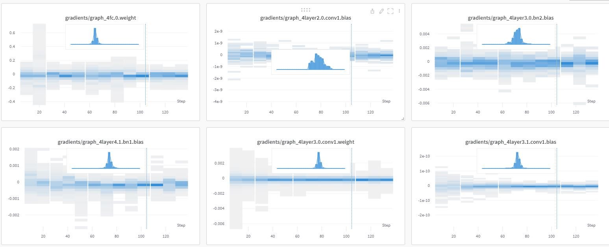

# Data Science Task
This is a repository containing code for downloading, processing, exploring, training and evaluating models on the [ptb-xl dataset](https://physionet.org/content/ptb-xl/1.0.3/).

I possess no previous knowledge on ECG data. I have developed this code using my knowledge on Data Science and Machine Learning, without having done an exhaustive literature search on the field.
I have selected a ResNet18 model following other similar approaches for this task (1d-signal data).

The focus on this repository would be on predicting the superclass labels (NORM, MI, STTC, CD and HYP), using the samplerate-100 data (as opposed to the samplerate-500 data). It is also possible to predict other labels (such as subclasses), but a 5-output prediction can be complicated enough, and this is just a week-project with some prototype code on the first steps I would follow if having to deal with this task.

The value of this repository is to be able to explore the dataset, with useful and easy-to-understand figures. The trained models in this repository can also be used to predict abnormalities on the ECG data (with an AUC of 0.8-0.9). This could ease the cardiac diagnosis of cardiac abnormalities, and so increase the chances of successful treatments, without the need of experts annotating the data manually.

An example use of this code could be to predict a score on cardiac abnormalities (labels MI, STTC, CD and HYP), and set a low thresholds (have quite some false positives), and then pass this ECG data to experts, which could make a final decision.
The models presented here should not be used for diagnostic purposes without expert supervision. The models have not been fine-tuned, nor they are understood once trained. 

I have also added a (naive) explainability pipeline, such that experts could use it to see why the model is making such diagnostic predictions.

Further work is needed in all directions of this repository.

# Structure

The structure of the code can be seen in four main blocks:
- Block 0: The [ptb-xl dataset](https://physionet.org/content/ptb-xl/1.0.3/) is downloaded, and processed using *wfdb* functions. Here, I implement the following tasks regarding the _ECG_ data
  - Read the _ECG_ files and corresponding annotations
  - Plot the _ECG_ signal in appropriate manner to be read by a doctor
  - Identify the heart beat of the signal, average and total heart beat in the signal
  - Identify the complex QRS in the signal and annotate on it
- Block 1: An exploration phase of the data, both for the _ECG_ signals and for the *.csv* files present. The tasks present here are:
  - Some data wrangling, on the annotations and demographics of the _ECG_ signals.
  - An exploration of the _ECG_ data according to lower-dimensional features.
  - Training of some simple algoritms [(Support Vector Machines)](https://en.wikipedia.org/wiki/Support_vector_machine) on these features.
- Block 2: Training on the _ECG_ signals, predicting the superclass labels (NORM, MI, STTC, CD and HYP) using a ResNet model.
- Block 3: Evaluation of the models trained in Block 2.

The notebooks start with a number, indicating the block to which they pertain.

The structure of the files is as follows:
- ***data/*** : Directory containing the *ptb-xl* data. It does not contain the data here, only locally (only *.csv* files).
- ***figs/*** : Figures used in the *README.md* file.
- ***0_Create_arrays.ipynb*** : Notebook that creates numpy arrays from the raw data, for later storing them in google drive for easier access. The arrays created are the _ECG_ data arrays, the label arrays, and *BPM* arrays, which are approximations of the mean heart beat, as computed with the [XQRS algorithm](https://wfdb.readthedocs.io/en/latest/processing.html).
- ***0_Read_ECG.ipynb***: Notebook containing some utilities for the _ECG_ data, like plotting the data, approximating the heart beat, computing the QRS, ...
- ***1_Features_Exploration.ipynb***: Notebook exploring the dataset using the features (also importing the heart beat features computed in the  *0_Create_arrays.ipynb* notebook. It also contains [SVC classifiers](https://scikit-learn.org/stable/modules/generated/sklearn.svm.SVC.html) on these features.
- ***1_Labels_Exploration.ipynb***: Notebook containing some ["data wrangling"](https://en.wikipedia.org/wiki/Data_wrangling) from the *.csv* files data, that could be useful, but it has not been used here in an actionable way.
- ***2_Training.ipynb***: Notebook containing the training procedure of a *ResNet* model, as defined in the *models.py* script, and does a simple hyperparameter search using a [Weights&Biases sweep](https://docs.wandb.ai/guides/sweeps).
- ***3_Evluation.ipynb***: Notebook where one model is evaluated, out of the trained models in the *2_Training.ipynb* notebook. This notebook is perhaps the most interesting one. It contains the prediction distributions, AUC and AUPRC curves, and a report function, where a [Saliency Map](https://arxiv.org/abs/1312.6034) (approximating feature relevance) is presented. This of course needs lots of improvement.
- ***3_Exploring_Evaluation.ipynb***: More useful plots used for evaluation, such as confusion matrices, and distribution of age, weight and height for the different classifications (true positives, true negatives, false positives, false negatives). This code should be extended in order to be more useful.
- ***models.py***: Script where the torch models are defined, to be called in the *2_Training.ipynb* notebook.
- ***train.py***: Script where the training function is defined, to be called in the *2_Training.ipynb* notebook.
- ***trainutils.py***: Script where some utils for training are defined, to be called both in the *train.py* script and *2_Training.ipynb* notebook.

# Environments
Due to the dataset being "big", and my personal laptop being almost agonal and with limited memory, I have decided to use [google colab](https://colab.research.google.com/) for running most of the notebooks, google drive to store the data (as numpy arrays) and [Weights&Biases](https://wandb.ai/site) for experiment tracking. 

However, the initial notebooks (*0_Create_arrays.ipynb* and *0_Read_ECG.ipynb*) are run locally. This is due to the fact that the data had been dowloaded locally. These local notebooks save the required data to [numpy arrays](https://numpy.org/doc/stable/reference/generated/numpy.array.html) and uploaded manually to Google Drive, to be loaded in the colab environments.

To run the local notebooks, the dependencies are as following:
## Dependencies for local environments
- *wfdb==4.0.0* to read and process ECG data
- *matplotlib==3.4.3* for plotting
- *numpy==1.23.4* as always
- *scipy==1.9.2* to do FFT transforms, etc
Better documentation on the dependencies is needed, and a *requirements.txt* file should be created. Some required packages may be missing.

For the colab notebooks, the dependencies are installed and imported in each notebook. It is recommended to use a GPU (cuda) environment.

# Lessons learned
It is not trivial to make predictions on ECG data. And due to the sensitive nature of ML use for healthcare, more robust pipelines, specially for explainability, need to be developed.

I have learned how to read and annotate ECG data, and some practices for train models. These repository is a "starting point", and extending it could provide for interesting, useful and actionable tools, if a proportional level of energy is put into this.

# Further work
In this repository I show prototype / first steps code for approaching this problem, focusing on the superclass level. This code can be extended to other labels, such as sub-class level.

Moreover, some features of the data (such as age, weight, ...) could be used as input features for the prediction. An example pipeline doing this could be one in which to separate networks perform some feature representation on the early layers (one, for example the ResNet architecture, for the ECG data, and other, for example a simple Dense network, for the other features) and then added together.

It would also be interesting to plot a lower-dimensional representation of the data present on the *1_Features_Exploration.ipynb* notebook. This could be done easily using, for example, [PCA](https://scikit-learn.org/stable/modules/generated/sklearn.decomposition.PCA.html), [UMAP](https://umap.scikit-tda.org/transform.html) or [t-SNE](https://scikit-learn.org/stable/modules/generated/sklearn.manifold.TSNE.html). I have not done this, since these representations may break the understanding on the features, and since the SVC classifiers give similar information on the separability of the data with respect to the labels.

Better features could be computed in the *1_Features_Exploration.ipynb* notebook. This, however, would require some domain knowledge that I do not possess, and it is expected that a complex neural network (such as the one used in this repository) would outperform a simple classifier on simple features. However, it is good to have simple features classifiers, both as a baseline, and also to understand the problem better, and to see if there are some interesting, and explainable, patterns in the data.
Better simple classifiers can also be defined, such as using SVC with kernels, or using K-means classifiers, decision trees, random forests, ... To keep the repository simple, only SVC are used.

Most of the work, for production, should be done on fine-tuning the neural network models. These are observed to achieve far better AUC scores than simple classifiers, and they are also more scalable to use with this huge dataset. No fine-tuning is present here, although this implementation already achieves resasonable AUC scores for all the labels. However, a better hyperparmeter tuning could be easily performed, and I have not done so for time limitations.

But, without a doubt, the most important work should be done in understanding the model's decisions. In the *3_Evaluation.ipynb* notebook I start this path. In the end of the notebook, the *get_report()* function gives easy-to-understand information of the model's decision /diagnosis for each patient. The saliency maps should indicate how much a feature (here, a segment of the input data) contributes to the model decision. Values with greater saliency values should be more relevant. However, this is often not true, and there are lots of problems with saliency maps.
Better explainability pipelines should be developed. First, that are better-aimed for time-series data, and second, that they are more useful for ECG diagnosis. 

Other explainability methods other than Saliency Maps are [Shapley Values](https://en.wikipedia.org/wiki/Shapley_value), that can be implemented via [SHAP](https://christophm.github.io/interpretable-ml-book/shap.html) and [DeepLIFT](https://github.com/kundajelab/deeplift), for example.

# References
No exhaustive literature study has been made.
For the model selection, I have followed this literature:
- [ECG Heartbeat Classification Based on ResNet and Bi-LSTM](https://iopscience.iop.org/article/10.1088/1755-1315/428/1/012014)
- [Deep Residual Learning for Image Recognition](https://arxiv.org/pdf/1512.03385.pdf)

For saliency maps (trying to understand the model decisions), I follow
- [Deep Inside Convolutional Networks: Visualising Image Classification Models and Saliency Maps](https://arxiv.org/abs/1312.6034)

and for "smoothed" saliency maps I follow
- [SmoothGrad: removing noise by adding noise](https://arxiv.org/pdf/1706.03825.pdf)

Better models exists, and better pipelines for explainability for ECG data and for time series. In this repository I made a prototype / first steps, considering the time-frame and expectations.

# ResNet model
Plot of the ResNet model used, using [torchviz](https://github.com/szagoruyko/pytorchviz) make_dot

# Wandb plots
Here I present some plots present in the Weights&Biases project, used to select the "best" model.
All models perform similarly in terms on validation loss, selecting the model with a learning rate of *0.00005*.

The [AUC Score](https://scikit-learn.org/stable/modules/generated/sklearn.metrics.roc_auc_score.html) and [AUPRC Score](https://scikit-learn.org/stable/modules/generated/sklearn.metrics.average_precision_score.html#sklearn.metrics.average_precision_score) are presented here per-label (NORM, MI, STTC, CD and HYP). AUC and AUPRC scores close to 1 make for a perfect classifier, whereas close to 0.5 make for a random classifier. All AUC and AUPRC scores here are greater than 0.8, meaning that the model performs relatively well for this data.

## Training and validation loss
Plots for all models (with different learning rates)

### Training loss evolution

### Validation loss evolution

## Best model
Plots for best model (lr 0.0005)

## Loss 

## AUC

## AUPRC

## Gradients visualization
Here some plots regarding the evolution of the gradients is presented. These plots are logged due to the *wandb.watch(model)* function.
Visualizing the gradient's evolution can be very useful for hyperparameter tuning, for understanding the training procedure and for spotting possible errors.

